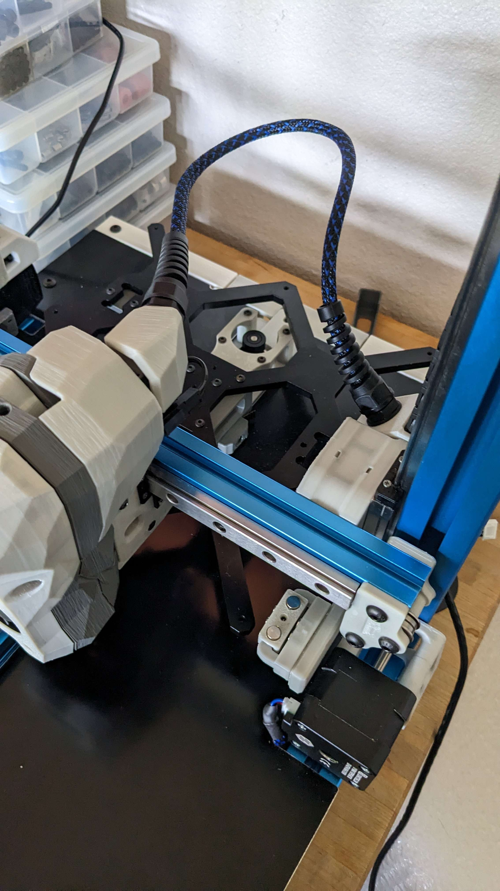

# Voron Stealthburner Umbilical for Canbus SB2209/SB2240 Toolhead PCBs

Designed by Stu Campbell

## Description
Allows for an umbilical on a Voron Switchwire, while using a BTT SB2209/SB2240 can bus toolhead pcb and the cable that comes with the PCB.

These files are designed to subliment/replace BTT's files located here:
https://github.com/bigtreetech/EBB/tree/master/EBB%20SB2240_2209%20CAN/Custom%20Printed%20Parts

## Use
The CW2 Cable Bridge part is reused and what the toolhead.stl mounts to, but the Printed Part for CAN Cable is replaced with said toolhead.stl.

The cablechain stl in this repo is used by mounting it sandwiched between the existing Switchwire cablechain mount and the z-axis cablechain terminus.

The threading on the parts is m12 so any cable gland with that threading should work, I used cheap pg7 glands with strain relief I found on amazon:
https://www.amazon.com/uxcell-Waterproof-Adjustable-Locknut-4-5-7-8mm/dp/B07R8CVW4G?th=1

## Notes
Both the toolchain and cablechain models will require some longer m3 bolts.  Not a lot, but areas will need approximately 3mm longer bolts.
